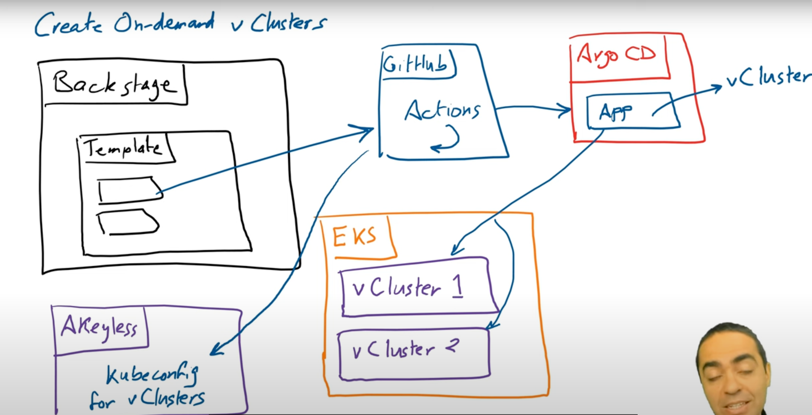

# Overview

This repo is used for demoing vCluster in a Platform Engineering Playground. Tools used are:

- ArgoCD
- Crossplane
- Backstage
- AWS
- GCP
- GitHub Actions
- vClusters

# Architecture 



### Required

kubectl
civo and CIVOT_TOKEN set 

## Management Cluster

cd istio_lessons/istio-terraform

```
terraform apply -target=civo_kubernetes_cluster.kubefirst -var="civo_token=$CIVO_TOKEN"

```
# Note! might have to remove all backups and run terraform init again


cd vcluster-demos/crossplane

```
civo apikey add default ${CIVO_TOKEN}

civo kubernetes config management --save --switch
kubectl cluster info
```

## Access ArgoCD on the management cluster

```
kubectl create namespace argocd

kubectl apply -n argocd -f https://raw.githubusercontent.com/argoproj/argo-cd/stable/manifests/install.yaml

helm repo add bitnami https://charts.bitnami.com/bitnami\nhelm repo add backstage https://backstage.github.io/charts

kubectl create ns backstage

kubectl get secret -n argocd argocd-initial-admin-secret -o json | jq -r '.data.password' | base64 --decode

kubectl patch svc argocd-server -n argocd -p '{"spec": {"type": "LoadBalancer"}}'

kubectl get svc argocd-server -n argocd -o jsonpath='{.status.loadBalancer.ingress[0].hostname}'


kubectl patch -n argocd configmap argocd-cm --type merge -p '{"data":{"accounts.admin":"apiKey"}}'


argocd login <hostname above> --username admin --password <password above> --insecure

export ARGOCD_AUTH_TOKEN=$(argocd account generate-token)

update action secrets in github and update secretes file in backstage folder

```

# Crossplane

```
helm repo add crossplane-stable https://charts.crossplane.io/stable

helm repo update

helm upgrade --install crossplane crossplane-stable/crossplane --namespace crossplane-system --create-namespace --wait

export CIVO_TOKEN_ENCODED=$(echo $CIVO_TOKEN | base64)

echo "apiVersion: v1\nkind: Secret\nmetadata:\n  name: civo-creds\ntype: Opaque\ndata:\n  credentials: $CIVO_TOKEN_ENCODED" | kubectl --namespace crossplane-system apply --filename -

kubectl get secret civo-creds -n crossplane-system -o yaml

kubectl apply -f xrds.yaml
kubectl apply -f providers/civo.yaml
kubectl apply -f compositions.yaml
kubectl apply -f provider-configs/provider-config-civo.yaml
kubectl create ns infra 
kubectl apply -f civo_claim.yaml

kubectl get compositeclusters
kubectl describe compositecluster civo-crossplane-cluster-rvpb7
kubectl get civokubernetes

```

Note! At this point even if you workload cluster, it will get recreated by crossplane because its now being managed by kubernetes

```
kubectl delete -f civo_claim.yaml
```


### Backstage

After updating secrets, copy secrets-example.sh to secrets.sh, then run 
```
cd vcluster-demos/backstage/my-backstage-app

./create_k8s_secrets_for_backstage.sh

kubectl apply -f my-backstage-secrets.yaml
```

 

```
yarn install --frozen-lockfile                                           
yarn tsc
yarn build:backend

docker buildx build --platform linux/amd64,linux/arm64 -t socrates12345/backstage:1.0.2 --push -f packages/backend/Dockerfile .

docker run -it -p 7007:7007 socrates12345/backstage:1.0.2
```

after updaing image tage in kubernetes/backstage-app/bs-deploy.yaml to 1.0.2 etc

```

kubectl apply -f ../../kubernetes/backstage-app

kubectl get pods -n backstage

kubectl describe pod backstage-app-654bc44b4c-ph56b -n backstage

kubectl logs backstage-app-54cfcf68c4-z4trm -n backstage


```
in another window

```
kubectl port-forward -n backstage service/backstage-app 80
```

then log onto the deployed service on port http://localhost:80

### Backstage changes

#### Use ngrok for GitHub to connect to ArgoCD

When Backstage creates a new GitHub repo, we need to get GitHub actions to create an ArgoCD app that monitors this new GitHub repo. We need to expose our local ArgoCD instance to the internet so that GitHub can connect to it. We will use ngrok for this. In production, you would use an ingress in your cluster with a domain name and DNS configured.

First, [sign up](https://dashboard.ngrok.com/signup) for a free ngrok account and get an authtoken


Notice that you will need to fill in secrets in the GitHub Actions Secrets section as shown in the image below:


These are the secrets:
- AKEYLESS_ACCESS_ID and AKEYLESS_API_ACCESS_KEY -> Credentials to access Akeyless to eventually drop the vCluster Kubeconfig in a static secret there.
- ARGOCD_USER -> admin
- ARGOCD_PASS -> the password you got from (kubectl get secret -n argocd argocd-initial-admin-secret -o json | jq -r '.data.password' | base64 --decode)
- ARGOCD_SERVER -> f1c6-24-150-170-114.ngrok-free.app (the ngrok server not URL, don't include https://)
ARGOCD_USER -> admin
- AWS_ACCESS_KEY_ID and AWS_SECRET_ACCESS_KEY -> AWS credentials to access the EKS cluster and generate vClusters
- CF_API_TOKEN and CF_ZONE_ID -> Credentials and Zone ID to access Cloudflare and create DNS records for the vClusters
- DOCKER_USERNAME and DOCKER_PASSWORD -> These are optional if you want to build your own Backstage image and push it to Docker Hub.
- GCP_CREDENTIALS -> Credentials to access GCP to eventually drop the vCluster Kubeconfig in a static secret in Akeyless.
- MYGITHUB_TOKEN -> you will need to create a Classic GitHub token from developer settings as shown in the next two images, or use the same one you have for Backstage in the `backstage/my-backstage-app/secrets.sh` file.
- TARGET_DOMAIN -> this is the hostname of the LoadBalancer that Traefik's ingressRouteTCP creates to access the vClusters. In case of EKS it's a hostname and in case of GKE it's an IP. (You will fill this out later after you create the EKS cluster.)


## Crossplane Secrets for Clouds

Most of the crossplane configuration in this repo were taken from Viktor Farcic, so shout out to him. Here is his original repo: https://github.com/vfarcic/crossplane-kubernetes


## Delete the K8s Cluster with Crossplane

```bash
kubectl --namespace infra delete \
    --filename ./crossplane/eks_claim.yaml
kubectl --namespace infra delete \
    --filename ./crossplane/gke_claim.yaml
kubectl get managed

# Wait until all the resources are deleted (ignore `object` and
#   `release` resources)
```

## Backstage

### Backstage Installation

To install Backstage first make sure you're in the `backstage` folder then do the following:

1. Rename `secrets-example.sh` to `secrets.sh` file in the `backstage/my-backstage-app` folder and add the environment variables you want. This file won't be checked into git. The `GITHUB_TOKEN` can be the same one you created earlier.
2. Run the script `create_k8s_secrets_for_backstage.sh` which will create a file called: `my-backstage-secrets.yaml` like this:
```bash
/workspaces/platform-engineering-playground/backstage/my-backstage-app/create_k8s_secrets_for_backstage.sh
```
3. Create this secret with:
```bash
kubectl apply -f /workspaces/platform-engineering-playground/backstage/my-backstage-app/my-backstage-secrets.yaml
```
4. If you want to access GCP, put your google creds json file here: `backstage/my-backstage-app/packages/backend/google-creds.json` then create a secret like this:
```bash
kubectl create secret generic google-creds \
  --from-file=google-creds.json=/workspaces/platform-engineering-playground/backstage/my-backstage-app/packages/backend/google-creds.json \
  --namespace backstage
```
in the `backstage/my-backstage-app/values.yaml` file uncomment the following lines:
```yaml
  extraVolumeMounts:
    # - name: google-creds-volume
    #   mountPath: "/etc/secrets"
    #   readOnly: true

  extraVolumes:
    # - name: google-creds-volume
    #   secret:
    #     secretName: google-creds
```
5. Finally run the `helm` command to install Backstage:
```bash
helm upgrade --install backstage backstage/backstage --namespace backstage -f /workspaces/platform-engineering-playground/backstage/my-backstage-app/values.yaml --set backstage.image.tag=v0.0.2
```

Wait until both the backstage and postgresql pods are running:

```bash
watch kubectl get po -n backstage
```

### Backstage Access

To access Backstage, you can port-forward the service like this below (Make sure the pod is running for a minute or so first):
```bash
kubectl port-forward -n backstage service/backstage 7007:7007
```

### Backstage Templates

You will already have some built-in templates that were created with the backstage app that you can explore in the UI and also take a look at the template files in the `backstage/my-backstage-app/packages/backend/templates` directory.

#### Update Templates as Needed

You will need to check the templates and make the necessary updates to work with your forked repo, specifically the 
`repoUrl: 'github.com?repo=platform-engineering-playground&owner=TeKanAid-Subscription'`

Once you make the change, commit and push the changes.

#### Register a New Template

But let's register a new one directly from the UI.

Click the `Create` button in the left naviation pane and then click the button called: `REGISTER EXISTING COMPONENT`

Enter the URL below where our K8s-Cluster-Crossplane template exists:
```
https://github.com/TeKanAid-Subscription/platform-engineering-playground/blob/main/backstage/my-backstage-app/packages/backend/templates/generic-k8s-cluster/template.yaml
```

Then once you've registered this template, you can now access it by clicking the `Create` button on the left navigation pane and selecting that template.

You can now create a K8s cluster with crossplane using Backstage. Here is the workflow:

Backstage -> GitHub Actions -> ArgoCD -> Crossplane -> you will end up with a secret in the newly created namespace in your cluster with the kubeconfig for the EKS cluster. 

You can check the progress of the K8s cluster creation by running the following commands:
```bash
kubens <your-cluster-name>
kubectl get managed
```

The name of the cluster you chose when filling out the Backstage template will be the name of the secret, e.g. `a-team-eks-cluster`. You can then use the following commands to access the new EKS cluster:

```bash
kubectl get secret a-team-eks-cluster -o jsonpath='{.data.kubeconfig}' | base64 -d > eks-kubeconfig.yaml
export KUBECONFIG=$(pwd)/eks-kubeconfig.yaml
kubectl get nodes
kubectl get namespaces
```

In the case of a GKE cluster you can access the cluster using the following

To get the kubeconfig:

```bash
gcloud container clusters get-credentials samgke --region us-east1 --project crossplaneprojects
```

#### Register the New Cluster in ArgoCD

Now you can register the new cluster in ArgoCD like this:

```bash
argocd cluster add your-cluster-context --name your-cluster-for-argocd
```

Example:

```bash
argocd cluster add my-new-eks-cluster --name eks-dev
```

## Create vClusters for Devs on our EKS Cluster

### Add the Target Domain

As platform engineers, we need to add the Target Domain to GitHub Actions secrets. The Target Domain is the hostname of the LoadBalancer that Traefik's ingressRouteTCP creates to access the vClusters in the case of EKS. In the case of GKE, it will be an IP address.

To get the value, run the following command:

```bash
# For EKS
kubectl get svc traefik -n traefik -o=jsonpath='{.status.loadBalancer.ingress[0].hostname}'
# For GKE
kubectl get svc traefik -n traefik -o=jsonpath='{.status.loadBalancer.ingress[0].ip}'
```

Now add this value to the `TARGET_DOMAIN` GitHub Actions secret.

### Add Parameter Values to the Backstage vCluster Template

As platform engineers, we need to add some values to variables in the Backstage vCluster template.

 add the endpoint for our K8s cluster inside our new vCluster template in Backstage.

These are the parameters that you will need to update based on your situation.

- hostEKSClusterName
- hostEKS_URLforArgo
- hostGKEClusterName
- hostGKEprojectName
- hostGKE_URLforArgo
- hostAKSClusterName
- hostAKS_URLforArgo

They are straight forward. Just note that the `hostEKS_URLforArgo`, `hostGKE_URLforArgo`, and `hostAKS_URLforArgo` parameters are the endpoints for our host K8s clusters. You can get the value of the endpoints from ArgoCD under settings > clusters and get the server URL under General.

Also remember to update  the appropriate parameters for your GitHub actions workflow name, the repo and branch name.

Here is an example:

```yaml
    - id: github-action
      name: Trigger GitHub Action
      action: github:actions:dispatch
      input:
        workflowId: vcluster_deploy.yaml
        repoUrl: 'github.com?repo=vcluster-demos&owner=tekanaid' # update this
        branchOrTagName: 'master' # update this
        workflowInputs:
          clusterName: ${{ parameters.clusterName }}
          repoURLforArgo: ${{ steps['publish'].output.remoteUrl }}
          hostClusterType: ${{ parameters.hostClusterType | string}}
          # You will need to make updates to all the parameters below.
          hostEKSClusterName: eks-host-cluster
          hostEKS_URLforArgo: https://5D795F1CE2F22C3B3BB93E19AA666DF4.gr7.us-east-1.eks.amazonaws.com
          hostGKEClusterName: samgke
          hostGKEprojectName: crossplaneprojects
          hostGKE_URLforArgo: https://34.23.68.174
          hostAKSClusterName: aks-host-cluster
          hostAKS_URLforArgo: https://
```

### Register a New vCluster Template in Backstage

Let's register a new template for creating a vCluster in Backstage.

Click the `Create` button in the left naviation pane and then click the button called: `REGISTER EXISTING COMPONENT`

Enter the URL below where our EKS-Cluster-Crossplane template exists:
```
https://github.com/TeKanAid-Subscription/platform-engineering-playground/blob/main/backstage/my-backstage-app/packages/backend/templates/vcluster/template.yaml
```

Then once you've registered this template, you can now access it by clicking the `Create` button on the left navigation pane and selecting that template.

You can now create a vCluster using Backstage, just follow the template steps and input values in the forms.

### Access the New vCluster

Wait until the vCluster component dashboard in Backstage shows the new vCluster as ready. 


Then, you can access the vCluster in Akeyless by getting the kubeconfig from the `Kubeconfig` static secret.

Get the Akeyless static secret at `/vclusters/Kubeconfig`. This is the base64 encoding of the kubeconfig file. Run the commands below to decode and use the kubeconfig:

```bash
ENCODED_KUBECONFIG=YXBpVmVyc2lvbjogdjEKY2x1c3RlcnM6Ci0gY2x1c3RlcjoKICAgIGNlcnRpZmljYXRlLWF1dGhvcml0eS1kYXRhOiBMUzB0TFMxQ1JVZEpUaUJEUlZKVVNVWkpRMEZVUlMwdExTMHRDazFKU1VKa2VrTkRRVkl5WjBGM1NVSkJaMGxDUVVSQlMwSm5aM0ZvYTJwUFVGRlJSRUZxUVdwTlUwVjNTSGRaUkZaUlVVUkVRbWh5VFROTmRHTXlWbmtLWkcxV2VVeFhUbWhSUkVVelRWUk5lVTFVU1hwUFJFVjNTR2hqVGsxcVVYZE9SRVV4VFdwQmVFOVVVWGhYYUdOT1RYcFJkMDVFUlhwTmFrRjRUMVJSZUFwWGFrRnFUVk5GZDBoM1dVUldVVkZFUkVKb2NrMHpUWFJqTWxaNVpHMVdlVXhYVG1oUlJFVXpUVlJOZVUxVVNYcFBSRVYzVjFSQlZFSm5ZM0ZvYTJwUENsQlJTVUpDWjJkeGFHdHFUMUJSVFVKQ2QwNURRVUZSUW1nd05VMVlTSE5PYm1salpUZzViVFZRWnk5MU4wTXJSMDQyYnpOcmNtVnhiRGQ2V1ZSRlQxY0tVbGh6Vm1wcVVGUmpRVzVTU2tGMGN6Sk5helZQY0VsR1YxQk9hbGwzUW1WMVlURTRURkl4VkV0WGFVVnZNRWwzVVVSQlQwSm5UbFpJVVRoQ1FXWTRSUXBDUVUxRFFYRlJkMFIzV1VSV1VqQlVRVkZJTDBKQlZYZEJkMFZDTDNwQlpFSm5UbFpJVVRSRlJtZFJWVFpUU1ZSbmJrSmtURFZDTm05ME5YY3daMnQ0Q2xCMmVGSlBjVEIzUTJkWlNVdHZXa2w2YWpCRlFYZEpSRk5CUVhkU1VVbG5WVVJYYTNWMFNWQlBWMk54TTNSbVdXazBNVGt4TDFoSmFYRk9RV2gyWm1zS1NWRXJSUzlRV1VoNFVuTkRTVkZETjNodWRrSklZalYzVkdjeldFZFFkelU1VkM5RVRIRndTelJtVjJWaWFWYzFPREZrWjFaRWJHMTBkejA5Q2kwdExTMHRSVTVFSUVORlVsUkpSa2xEUVZSRkxTMHRMUzBLCiAgICBzZXJ2ZXI6IGh0dHBzOi8vc2FtLWVrcy12Y2x1c3Rlci50ZWthbmFpZC5jb20KICBuYW1lOiBteS12Y2x1c3Rlcgpjb250ZXh0czoKLSBjb250ZXh0OgogICAgY2x1c3RlcjogbXktdmNsdXN0ZXIKICAgIHVzZXI6IG15LXZjbHVzdGVyCiAgbmFtZTogbXktdmNsdXN0ZXIKY3VycmVudC1jb250ZXh0OiBteS12Y2x1c3RlcgpraW5kOiBDb25maWcKcHJlZmVyZW5jZXM6IHt9CnVzZXJzOgotIG5hbWU6IG15LXZjbHVzdGVyCiAgdXNlcjoKICAgIGNsaWVudC1jZXJ0aWZpY2F0ZS1kYXRhOiBMUzB0TFMxQ1JVZEpUaUJEUlZKVVNVWkpRMEZVUlMwdExTMHRDazFKU1VKclJFTkRRVlJsWjBGM1NVSkJaMGxKVUdsWU5VOVpTSGx2VERSM1EyZFpTVXR2V2tsNmFqQkZRWGRKZDBsNlJXaE5RamhIUVRGVlJVRjNkMWtLWVhwT2VreFhUbk5oVjFaMVpFTXhhbGxWUVhoT2VrVjZUV3BGZVUxNlozaE5RalJZUkZSSk1FMUVVWGhPVkVsM1RWUnJNRTFXYjFoRVZFa3hUVVJSZUFwT1ZFbDNUVlJyTUUxV2IzZE5SRVZZVFVKVlIwRXhWVVZEYUUxUFl6TnNlbVJIVm5SUGJURm9Zek5TYkdOdVRYaEdWRUZVUW1kT1ZrSkJUVlJFU0U0MUNtTXpVbXhpVkhCb1drY3hjR0pxUWxwTlFrMUhRbmx4UjFOTk5EbEJaMFZIUTBOeFIxTk5ORGxCZDBWSVFUQkpRVUpLUWk5V2MyMUJPVmRHTlV0U1VrMEtZMkpHVGtGWU9ETnNiMXBQYXpaU1JXSkdMMGxqVXpWVmRIbEJMM00xU2pRMlUzTjRlRFpPWTBack9VVTJUMUE1U1M4MldFWkNlSFJqYXk5M1JtbERlQXBOT0ZOTloyRXlhbE5FUWtkTlFUUkhRVEZWWkVSM1JVSXZkMUZGUVhkSlJtOUVRVlJDWjA1V1NGTlZSVVJFUVV0Q1oyZHlRbWRGUmtKUlkwUkJha0ZtQ2tKblRsWklVMDFGUjBSQlYyZENVVWRGSzA5T09HUjJia2RYVldOYVprVk5NVUp1YW14NWNtUlpSRUZMUW1kbmNXaHJhazlRVVZGRVFXZE9TRUZFUWtVS1FXbEJXalpDTTJ0R2J6SldXVWRWU1c5SU9DODRibEpWVWpCSVVHcDVaVWhJZEhacWNqQnhNVk5FVjIwNWQwbG5TMEZVZG1KNWIzRXdiR1kxWVVSMGJBcDNhRXN6VDFONVFVMXFOMFpSTlVOVE9YRmlZbEJXWW5oallVazlDaTB0TFMwdFJVNUVJRU5GVWxSSlJrbERRVlJGTFMwdExTMEtMUzB0TFMxQ1JVZEpUaUJEUlZKVVNVWkpRMEZVUlMwdExTMHRDazFKU1VKbFJFTkRRVkl5WjBGM1NVSkJaMGxDUVVSQlMwSm5aM0ZvYTJwUFVGRlJSRUZxUVdwTlUwVjNTSGRaUkZaUlVVUkVRbWh5VFROTmRGa3llSEFLV2xjMU1FeFhUbWhSUkVVelRWUk5lVTFVU1hwUFJFVjNTR2hqVGsxcVVYZE9SRVV4VFdwQmVFOVVVWGhYYUdOT1RYcFJkMDVFUlhwTmFrRjRUMVJSZUFwWGFrRnFUVk5GZDBoM1dVUldVVkZFUkVKb2NrMHpUWFJaTW5od1dsYzFNRXhYVG1oUlJFVXpUVlJOZVUxVVNYcFBSRVYzVjFSQlZFSm5ZM0ZvYTJwUENsQlJTVUpDWjJkeGFHdHFUMUJSVFVKQ2QwNURRVUZVYm5wMFJUZGplV1YyVkRFMFJVYzJSbVJyU0RaVFpuWmxWRWRrTVdGQ2FtWjJjVzE1ZVVsSGVFa0tkVTl3ZEdZclREZGFiblJ5VkhnMVdHSTNZazl0TUVkT1IyVkVTa3RoTVc5MU5XeFBWM2hEYkVGaE1XeHZNRWwzVVVSQlQwSm5UbFpJVVRoQ1FXWTRSUXBDUVUxRFFYRlJkMFIzV1VSV1VqQlVRVkZJTDBKQlZYZEJkMFZDTDNwQlpFSm5UbFpJVVRSRlJtZFJWVUpvVUdwcVpraGlOWGhzYkVoSFdIaEVUbEZhQ2pRMVkzRXpWMEYzUTJkWlNVdHZXa2w2YWpCRlFYZEpSRk5SUVhkU1owbG9RVXBSYlVkblVreEtVbEJyV0dJNVNXZDVWMU5DT1VWUVl6bE5WblJ2UXpVS2JIUlZaMDVCY1VnelUxaGxRV2xGUVhVd2FtMTFWVkl4ZWpseGFGTnFiVTh3TldOa05WQXpRWFpRVXpKRFQxUlZMelJaTmxkblUyUjNNVlU5Q2kwdExTMHRSVTVFSUVORlVsUkpSa2xEUVZSRkxTMHRMUzBLCiAgICBjbGllbnQta2V5LWRhdGE6IExTMHRMUzFDUlVkSlRpQkZReUJRVWtsV1FWUkZJRXRGV1MwdExTMHRDazFJWTBOQlVVVkZTVUp4WW5sTGJHOUZXREZuVGtONFVscFZOekpRY3pWV1oyNUZjMmRJVURWTk5XTnFjVWxaUTI5VlRFeHZRVzlIUTBOeFIxTk5ORGtLUVhkRlNHOVZVVVJSWjBGRmEwZzVWM2xaUkRGWldHdHdSa1Y0ZUhOVk1FSm1lbVZYYUdzMlZIQkZVbk5ZT0doNFRHeFRNMGxFSzNwcmJtcHdTM3BJU0Fwdk1YZFhWREJVYnpRdk1Hb3ZjR05WU0VjeGVWUXZRVmRKVEVWNmVFbDVRbkpSUFQwS0xTMHRMUzFGVGtRZ1JVTWdVRkpKVmtGVVJTQkxSVmt0TFMwdExRbz0K
echo $ENCODED_KUBECONFIG | base64 --decode > vcluster_kubeconfig.yaml
export KUBECONFIG=vcluster_kubeconfig.yaml
kubectl get ns
kubectl get nodes
```

#### Congrats on building an Internal Developer Platform with vCluster!
